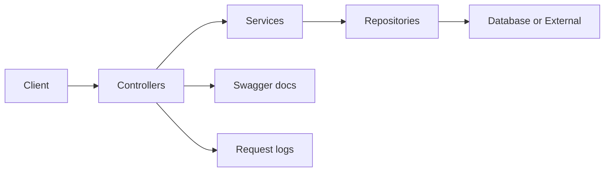
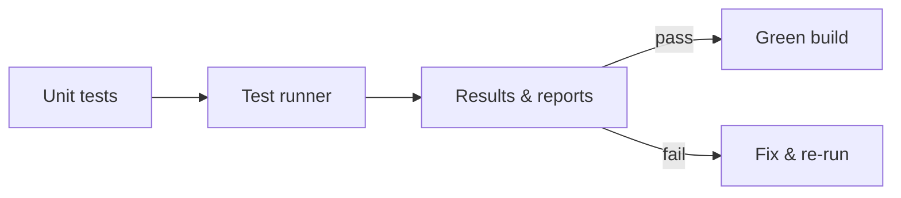

# Google Developer Student Club (GDSC) — NCCUPass App Backend Engineer

**Role:** Backend Engineer (GDSC @ NCCU)  
**When:** 2023–2024 *(club project)*

> **Disclaimer:** This portfolio uses sanitized descriptions and **synthetic examples only**.  
> No proprietary code, credentials, student data, or internal configs are included.

---

## Problem
NCCUPass is a student app that bundles multiple campus services, including personal tutoring, food takeout, and campus social and online dating, alongside login and digital passes. To keep these experiences smooth, the backend needs reliable, well-documented, and discoverable **REST APIs**. When API contracts, versioning, and error semantics aren’t clear, teams run into fragile integrations, slower incident response, and regressions whenever new features ship.

---

## P1 — Build Resturant Feature REST API (C#, ASP.NET Core)
**Solution:** Built an **ASP.NET Core Web API in C#** with clean layering and OpenAPI docs to power NCCUPass features; I owned the entire **Restaurant** domain (e.g., menu browse, order create and status endpoints).

**Highlights**
- **Architecture:** I structured the API into **Controllers, Services, and Repositories**, used **DTOs** for requests and responses, and applied **model validation** to keep boundaries clear and inputs safe.
- **Middleware:** I added **centralized exception handling** and **structured logging** with per-request correlation IDs so issues are easy to trace in logs.
- **Documentation:** I exposed **Swagger** and **OpenAPI** so teammates can discover endpoints, understand contracts, and try calls directly in the browser.
- **Configuration:** I used environment-specific **appsettings** and secrets, and provided **health** and **readiness** endpoints for basic operational checks.

**Impact**
- **Faster to build and change:** Clear API docs and a small layered design made integrations easier and reduced rework.
- **Easier to debug:** Uniform error responses and request IDs helped us find and fix issues quicker.

**Pipeline (simplified)**


---

## P2 — Load & Stress Testing (k6)
**Solution:** Wrote a **k6** test suite to validate throughput, p95 latency, and error rates for NCCUPass; the suite targets key Restaurant endpoints (health, menu browse, order create/status) and runs locally or in CI with a configurable `BASE_URL`.

**Highlights**
- **Scenarios:** I provided **smoke**, **ramping**, and **steady-state** scenarios so we can do quick sanity checks, observe behavior under increasing load, and hold a constant arrival rate for a few minutes.
- **Thresholds:** I set practical guards such as **error rate < 1%** and **p95 latency under a target budget**, with separate expectations for read (menu) and write (order) paths to reflect their different costs.
- **Parameterization:** I used environment variables (for example, `BASE_URL` and auth/token headers) and small seeded JSON payloads so tests can run against **dev**, **staging**, or **local** without code edits.
- **Reporting:** I enabled concise console summaries and optional JSON outputs; the scripts print endpoint-level pass and fail so we can spot regressions fast, and they are lightweight enough to run as a CI smoke step.

**Impact**
- **Performance baseline:** We established clear baselines for success (p95 and error rate), which made performance changes measurable release-to-release.
- **Faster diagnosis:** The suite consistently highlighted slow or flaky endpoints, guiding fixes like pagination, caching warm-ups, and safer timeouts before feature rollouts.

**Pipeline (simplified)**
```mermaid
flowchart LR
  K[k6 runner] --> S[Chosen scenario\n(smoke / ramp / steady)]
  S --> A[API under test]
  A --> M[Response metrics]
  M --> T[Threshold checks\n(p95, error rate)]
  T -->|pass| G[Green build]
  T -->|fail| R[Investigate & fix]
```

---

## P3 — Unit Testing (.NET)
**Solution:** Added a **.NET unit test project** to validate controllers, services, and utility logic for NCCUPass; tests cover both read paths (e.g., menu queries) and write paths (e.g., order creation) with external calls mocked or faked.

**Highlights**
- **Test style:** I wrote tests in an **Arrange–Act–Assert** style with clear **Given/When/Then** names so intent is obvious when failures happen.
- **Isolation:** I mocked repository and HTTP dependencies and seeded small in-memory datasets so tests run fast and deterministically without hitting real services.
- **Data-driven cases:** I used parameterized tests to cover edge cases like empty menus, invalid order payloads, and transient failures, which increased coverage without bloating code.
- **Results & CI:** I enabled console summaries and optional TRX/JUnit outputs so CI can surface pass/fail status and flaky tests quickly.

**Impact**
- **Safer refactors:** Core flows stay correct as features evolve, reducing regressions in API behavior.
- **Fewer production bugs:** Common failure modes are caught locally, shortening the feedback loop for developers.

**Pipeline (simplified)**

